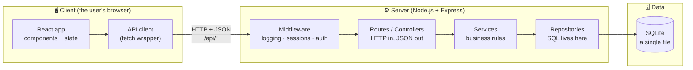
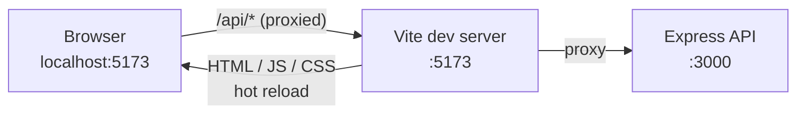
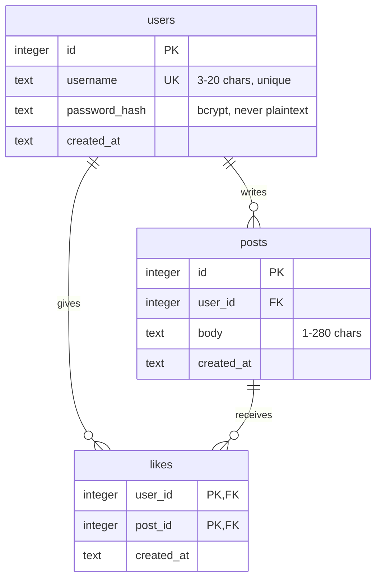
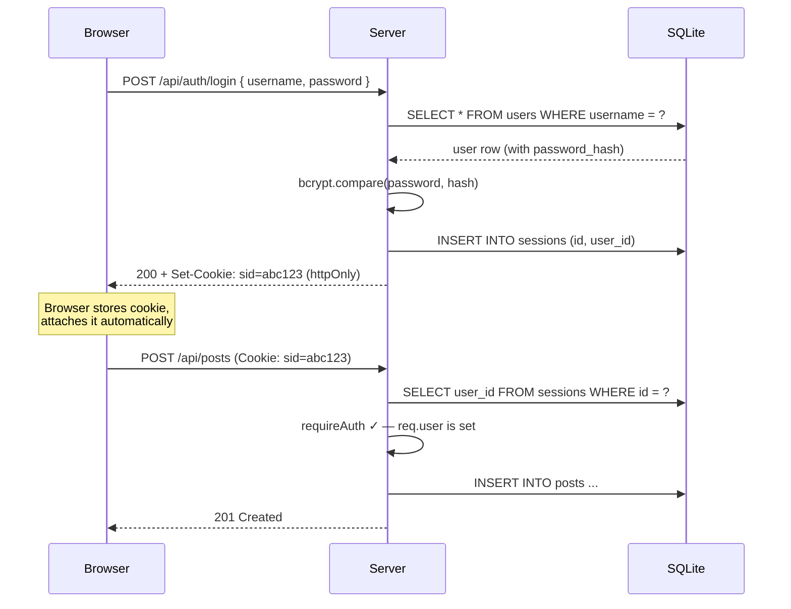
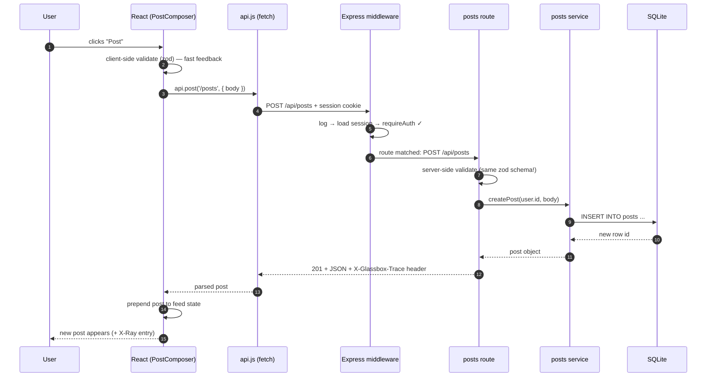

# Glassbox — Design Document

> **A tiny social message board that shows you its own internals.**
> The goal of this project is not the app — it's *understanding how apps work*.
> Every layer (frontend, backend, API, database, auth) is deliberately simple,
> readable, and observable.

---

## 1. Vision & Learning Goals

Most tutorials teach you to *copy* an app. Glassbox is designed so that
**using the app teaches you how it works**. It does this in two ways:

1. **The codebase is a teaching artifact.** Every layer is explicit — no
   frameworks that hide the interesting parts. You can trace a button click
   all the way to a SQL query by reading the code top-to-bottom.
2. **The app has an X-Ray panel.** A slide-out panel in the UI that shows,
   live, for every action you take: the HTTP request that was sent, the
   route that handled it, the middleware it passed through, the SQL that
   ran, and how long each step took.

### What you'll learn by building it

| Concept | Where it shows up |
|---|---|
| Client/server model | Browser (React) talks to an API server over HTTP |
| HTTP & REST | JSON API with proper methods, status codes, headers |
| Frontend architecture | Components, state, routing, data fetching |
| Backend architecture | Layered design: routes → middleware → controllers → services → repositories |
| Databases | SQLite with hand-written SQL, schema design, migrations |
| Authentication | Password hashing, sessions, cookies, protected routes |
| Validation & errors | Input validation, error handling, status codes |
| System design basics | Why layers exist, where caching/scaling would go |

---

## 2. The App Concept

**Glassbox** is a micro message board:

- **Sign up / log in** with username + password
- **Post** short messages (max 280 chars)
- **See a feed** of everyone's posts, newest first
- **Like** posts (and unlike them)
- **View a profile** — a user's posts and stats

That's the whole MVP. Small on purpose — every feature exists to exercise a
fundamental concept:

| Feature | Concept it teaches |
|---|---|
| Sign up / log in | Auth, password hashing, sessions, cookies |
| Posting | POST requests, validation, writes to DB |
| Feed | GET requests, queries with JOINs, pagination |
| Likes | Relations (many-to-many), idempotency, optimistic UI |
| Profiles | URL parameters, aggregate queries (COUNT) |

### The X-Ray Panel (the signature feature)

A toggleable panel (keyboard shortcut: `` ` ``) docked to the right side of
the UI. Every time the frontend talks to the backend, a new entry appears
showing the **full request lifecycle**:

```
POST /api/posts                                    201 · 14ms
├─ Request    { "body": "hello world" }  cookie: sid=…
├─ Middleware requestLogger → session → requireAuth ✓
├─ Handler    posts.create
├─ SQL        INSERT INTO posts (user_id, body) VALUES (?, ?)   2ms
└─ Response   201 Created  { "id": 42, "body": "hello world", … }
```

**How it works:** the backend collects trace data for each request
(middleware hit, SQL executed, timings) and returns it in a `X-Glassbox-Trace`
response header (dev mode only). The frontend's API client reads that header
and feeds the X-Ray panel. This is a miniature version of real-world
*distributed tracing* (like OpenTelemetry) — a system design lesson in itself.

---

## 3. System Architecture

The classic three-tier architecture — the shape of most web apps in the world:



**Why this shape?** Separation of concerns. The browser never touches the
database; the database never knows about HTTP. Each layer has one job, which
is what makes real systems testable, replaceable, and scalable. The design
doc for every big system you'll ever see is a variation of this picture.

### In development: two servers, one origin



Vite serves the frontend with hot reload and **proxies** `/api/*` to Express.
This sidesteps CORS in dev and mirrors how production reverse proxies
(nginx, load balancers) work — another quiet system design lesson.

---

## 4. Tech Stack (and *why* each choice)

| Layer | Choice | Why (for learning) |
|---|---|---|
| Frontend | **React 18 + Vite** | Industry standard; Vite is fast and simple |
| Frontend routing | **react-router** | Teaches client-side routing vs. server routing |
| Server state | **Hand-rolled hooks** (no React Query yet) | You learn *why* libraries like React Query exist by feeling the pain first |
| Backend | **Node.js + Express** | Minimal, unopinionated — every line is yours |
| Database | **SQLite** (`better-sqlite3`) | Zero setup, it's just a file; real SQL, no ORM magic |
| SQL | **Hand-written SQL** | You learn actual SQL, not an ORM's dialect |
| Auth | **Sessions + httpOnly cookies** | Simpler & safer to learn than JWT; JWT covered as a "phase 6" extension |
| Passwords | **bcrypt** | The standard; teaches *why we never store plaintext* |
| Validation | **zod** | Shared schemas between client and server — teaches the trust boundary |
| Language | **JavaScript + JSDoc types** | One less compiler to configure; TypeScript is a listed extension |
| Testing | **Vitest + supertest** | Unit tests (services) + API tests (HTTP level) |

**Guiding rule:** *no magic*. Prefer 20 lines of readable code over a
dependency, everywhere it's practical.

---

## 5. Data Model

Three tables. Small enough to hold in your head, rich enough to teach
one-to-many, many-to-many, foreign keys, and aggregates.



Notes:

- `likes` has a **composite primary key** `(user_id, post_id)` — the DB
  itself guarantees you can't like a post twice. Lesson: *push invariants
  into the schema when you can.*
- Schema lives in numbered migration files (`001_init.sql`, …) applied at
  startup — a simple, honest version of what migration tools do.
- The feed query is the teaching centerpiece: one `SELECT` with a `JOIN`
  (author username), an aggregate (`COUNT` of likes), a correlated check
  ("did *I* like this?"), `ORDER BY`, and `LIMIT/OFFSET` pagination.

---

## 6. API Design (REST)

All endpoints under `/api`, JSON in / JSON out.

| Method & path | Auth? | Purpose | Success | Failures |
|---|---|---|---|---|
| `POST /api/auth/signup` | — | Create account, start session | `201` user | `400` invalid, `409` username taken |
| `POST /api/auth/login` | — | Verify password, start session | `200` user | `401` bad credentials |
| `POST /api/auth/logout` | ✓ | Destroy session | `204` | — |
| `GET /api/auth/me` | — | Who am I? (session check) | `200` user or `null` | — |
| `GET /api/posts?page=1` | — | Paginated feed | `200` posts + page info | `400` bad page |
| `POST /api/posts` | ✓ | Create a post | `201` post | `400` invalid, `401` |
| `DELETE /api/posts/:id` | ✓ | Delete own post | `204` | `401`, `403` not yours, `404` |
| `PUT /api/posts/:id/like` | ✓ | Like (idempotent) | `204` | `401`, `404` |
| `DELETE /api/posts/:id/like` | ✓ | Unlike (idempotent) | `204` | `401`, `404` |
| `GET /api/users/:username` | — | Profile + their posts | `200` | `404` |

Design lessons baked in:

- **Status codes carry meaning** — `401` (who are you?) vs `403` (you can't
  do that) vs `404` (no such thing) vs `409` (conflict).
- **Like is `PUT`, not `POST`** — liking twice is a no-op. That's
  *idempotency*, and it matters enormously in real systems (retries!).
- **Errors have one shape** everywhere:
  `{ "error": { "code": "VALIDATION", "message": "...", "details": [...] } }`
- **Pagination from day one** — `{ "items": [...], "page": 2, "hasMore": true }`.

---

## 7. Backend Design

Express app with an explicit layered structure. Data flows down, results
flow back up. Each layer only talks to the one below it.

```
HTTP request
   │
   ▼
middleware/        cross-cutting: logging, session loading, auth guard, tracing
   │
   ▼
routes/            "controllers" — parse HTTP, validate input, call a service,
   │                shape the JSON response. NO business logic here.
   ▼
services/          business rules — "you can only delete your own post".
   │                Knows nothing about HTTP. Throws typed errors (NotFound…).
   ▼
db/repositories/   all SQL lives here. Knows nothing about business rules.
   │
   ▼
SQLite
```

**Why layers?** Swap-ability and testability. Services can be unit-tested
without a web server. SQLite could be swapped for Postgres by touching only
the repository layer. Typed service errors (`NotFoundError`,
`ForbiddenError`) are translated to status codes in *one* place — a central
error-handling middleware — instead of scattered `res.status(...)` calls.

### Auth flow (sessions + cookies)



Key lessons: passwords are hashed with bcrypt (never stored, never
recoverable); the session cookie is `httpOnly` (JavaScript can't read it —
XSS protection); the server, not the client, is the source of truth about
who you are.

---

## 8. Frontend Design

### Pages & routes

| Route | Page | Notes |
|---|---|---|
| `/` | Feed | Post composer (if logged in) + paginated post list |
| `/login`, `/signup` | Auth forms | Redirect to `/` when already logged in |
| `/u/:username` | Profile | User's posts + stats |
| `*` | Not found | Mirrors the API's 404 concept |

### Component tree

```
<App>                          AuthContext (current user) + XRayContext
 ├─ <NavBar>                   login/logout, current user
 ├─ <Routes>
 │   ├─ <FeedPage>
 │   │    ├─ <PostComposer>    controlled form, char counter, validation
 │   │    └─ <PostList>
 │   │         └─ <PostCard>   author, body, time, <LikeButton>
 │   ├─ <LoginPage> / <SignupPage>
 │   └─ <ProfilePage>
 └─ <XRayPanel>                the request-lifecycle inspector
```

### State management — three kinds of state, named explicitly

1. **Server state** (posts, profiles) — fetched via a custom `useApi` hook;
   loading / error / data handled explicitly. *This is the hard 80% of
   frontend work, and we don't hide it.*
2. **Session state** (current user) — React context, hydrated once from
   `GET /api/auth/me` on load.
3. **UI state** (form inputs, panel open/closed) — plain local `useState`.

### One deliberate "fancy" bit: optimistic likes

Clicking like updates the UI **immediately**, then sends the request; on
failure it rolls back. Teaches latency-hiding, the risk of client/server
divergence, and reconciliation — with the X-Ray panel showing the request
completing *after* the UI already changed.

### The API client (`api.js`)

One small fetch wrapper used by everything: sets JSON headers, sends
cookies, parses the error envelope into a typed `ApiError`, and reads the
`X-Glassbox-Trace` header to feed the X-Ray panel. Lesson: *centralize the
seam between client and server.*

---

## 9. A Full Request, Traced (the core lesson)

What happens when you click **Post**:



Note step 2 *and* step 8: **validation happens twice**. Client-side for
instant feedback; server-side because *the server can never trust the
client* — anyone can send bytes at your API with `curl`. That trust
boundary is possibly the single most important idea in web development.

---

## 10. Project Structure

A monorepo with two packages — mirrors the client/server split physically:

```
glassbox/
├── DESIGN.md                  ← you are here
├── package.json               workspace root (npm workspaces)
├── docs/
│   └── lessons/               one short doc per concept, linked from code
├── server/
│   ├── package.json
│   └── src/
│       ├── index.js           entry: create app, apply migrations, listen
│       ├── app.js             express app wiring (exported for tests)
│       ├── middleware/        logger.js · session.js · auth.js · trace.js · errors.js
│       ├── routes/            auth.js · posts.js · users.js
│       ├── services/          authService.js · postService.js · userService.js
│       ├── db/
│       │   ├── migrations/    001_init.sql …
│       │   ├── database.js    connection + migration runner + traced exec
│       │   └── repositories/  userRepo.js · postRepo.js · likeRepo.js
│       └── errors.js          NotFoundError, ForbiddenError, …
├── shared/
│   └── validation.js          zod schemas used by BOTH client & server
└── web/
    ├── package.json
    ├── vite.config.js         dev proxy → :3000
    └── src/
        ├── main.jsx · App.jsx
        ├── api.js             the fetch wrapper + trace capture
        ├── context/           AuthContext.jsx · XRayContext.jsx
        ├── hooks/             useApi.js
        ├── pages/             FeedPage · LoginPage · SignupPage · ProfilePage
        └── components/        NavBar · PostComposer · PostCard · LikeButton · XRayPanel
```

The `shared/` package is a lesson on its own: the *same* validation schema
runs in the browser and on the server, so the rules can't drift apart.

---

## 11. Cross-Cutting Concerns

- **Error handling:** services throw typed errors; one Express error
  middleware maps them to status codes and the standard error envelope.
  Nothing else in the codebase calls `res.status(500)`.
- **Security (the teachable minimum):** bcrypt password hashing; `httpOnly`
  + `SameSite=Lax` session cookie (CSRF mitigation); parameterized SQL only
  (SQL injection); React's default escaping (XSS); server-side validation
  on every write.
- **Testing strategy:**
  - *Unit tests* on services (fast, no HTTP, in-memory SQLite).
  - *API tests* with supertest (spin up the app, make real HTTP calls,
    assert status codes and bodies — signup → login → post → like flows).
  - A couple of frontend component tests (composer validation, like rollback).
- **Logging:** one line per request — method, path, status, duration. The
  same data feeds the X-Ray trace.

---

## 12. Build Plan — 6 Phases

Each phase produces something that **runs**, and each maps to a concept
cluster. (Roughly one PR per phase.)

| Phase | Deliverable | You learn |
|---|---|---|
| **1. Skeleton** | Monorepo, Express serving `GET /api/health`, React showing the result, Vite proxy | Client/server split, HTTP round trip, dev tooling |
| **2. Data layer** | SQLite, migrations, repositories, seed script; feed read-only from real data | SQL, schema design, the repository pattern |
| **3. Auth** | Signup/login/logout/me, sessions, cookies, `requireAuth` | Hashing, sessions, cookies, middleware |
| **4. Core features** | Posting, deleting, likes, profiles, pagination | Validation, REST semantics, idempotency, optimistic UI |
| **5. X-Ray panel** | Trace middleware + header + panel UI | Observability, the full request lifecycle |
| **6. Hardening** | Error envelope everywhere, tests, docs/lessons pass | Testing, error design, polish |

### Future extensions (each is a system-design lesson)

- **Postgres swap** → why the repository layer earns its keep
- **JWT mode** → stateless auth vs. sessions, and the tradeoffs
- **WebSockets** → live feed updates, push vs. poll
- **Caching layer** → memoize the feed query, cache invalidation pain
- **Rate limiting** → protecting APIs from abuse
- **Docker + deploy** → what "production" actually means
- **TypeScript migration** → types as documentation

---

## 13. Open Questions for Review

1. **App concept OK?** A message board maximizes concept coverage per
   feature, but it could equally be a recipe box / bookmark manager if you
   prefer — the architecture is identical.
2. **JavaScript + JSDoc vs. TypeScript from day one?** JS keeps the
   toolchain minimal; TS is more industry-realistic but adds config and
   compiler friction while learning.
3. **Sessions vs. JWT for the MVP?** Design says sessions (simpler mental
   model, safer defaults); JWT as a later extension.
4. **X-Ray panel in phase 5** — or build a minimal version earlier (phase 2)
   so it's usable while learning the other phases?
5. **How deep should `docs/lessons/` go?** One page per concept, or keep all
   explanation in code comments?
