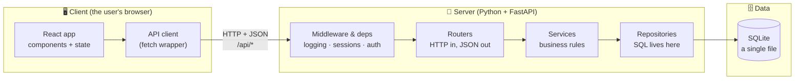
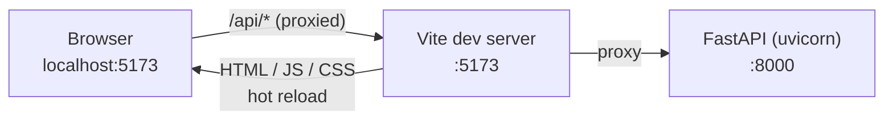
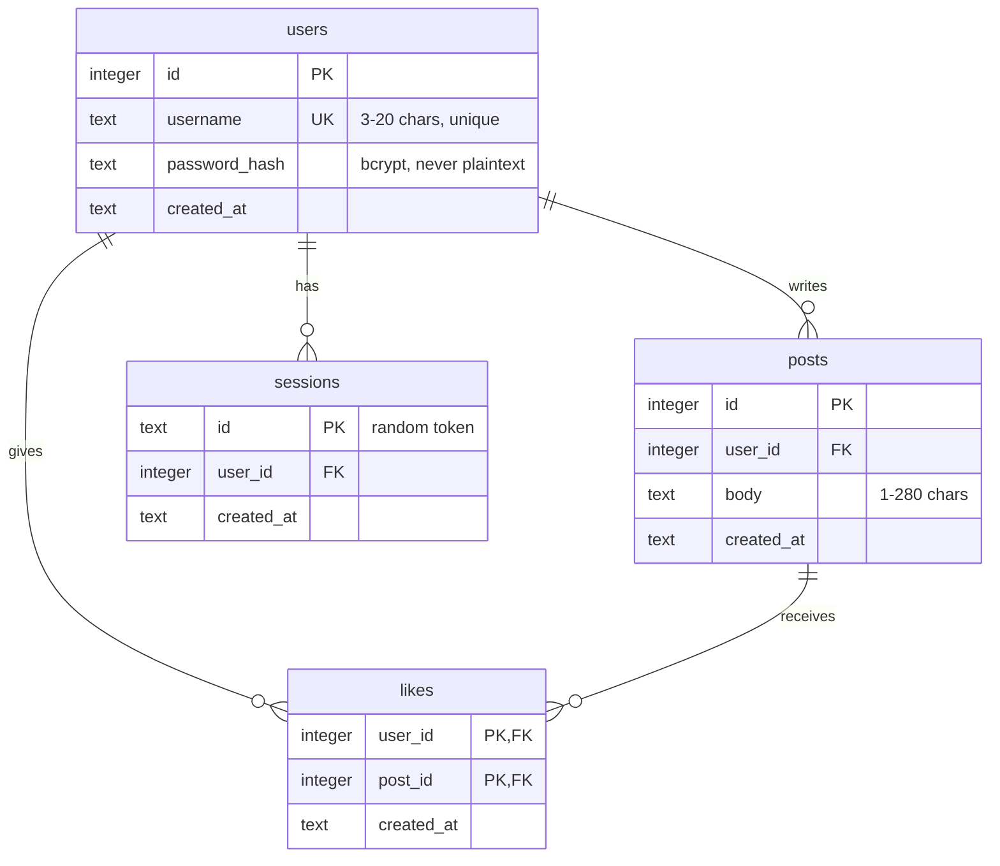
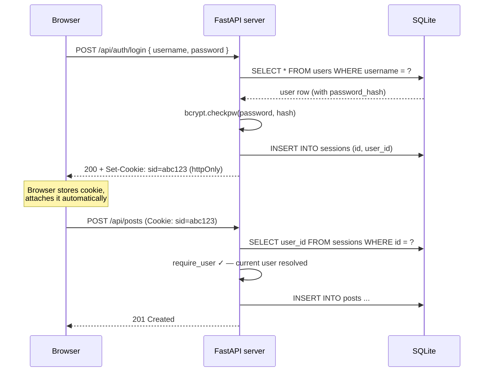
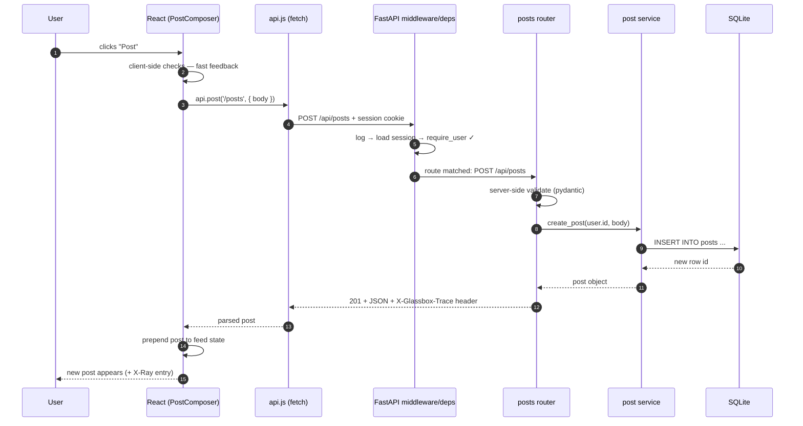

# Glassbox — Design Document

> **A tiny social message board that shows you its own internals.**
> The goal of this project is not the app — it's *understanding how apps work*.
> Every layer (frontend, backend, API, database, auth) is deliberately simple,
> readable, and observable.

---

## 1. Vision & Learning Goals

Most tutorials teach you to *copy* an app. Glassbox is designed so that
**using the app teaches you how it works**. It does this in two ways:

1. **The codebase is a teaching artifact.** Every layer is explicit — no
   frameworks that hide the interesting parts. You can trace a button click
   all the way to a SQL query by reading the code top-to-bottom.
2. **The app has an X-Ray panel.** A slide-out panel in the UI that shows,
   live, for every action you take: the HTTP request that was sent, the
   route that handled it, the SQL that ran, and how long each step took.

### What you'll learn by building it

| Concept | Where it shows up |
|---|---|
| Client/server model | Browser (React) talks to a Python API server over HTTP |
| HTTP & REST | JSON API with proper methods, status codes, headers |
| Frontend architecture | Components, state, routing, data fetching |
| Backend architecture | Layered design: routers → services → repositories |
| Databases | SQLite with hand-written SQL, schema design, migrations |
| Authentication | Password hashing, sessions, cookies, protected routes |
| Validation & errors | Input validation, error handling, status codes |
| System design basics | Why layers exist, where caching/scaling would go |

### Two languages, one lesson

The backend is **Python** (your home turf); the frontend is **JavaScript**,
because the browser only runs JavaScript. This split is not a compromise —
it's how most real teams work, and it makes the most important boundary in
web development *visible*: the two sides share nothing except **HTTP and
JSON**. Whatever crosses that wire is the contract.

---

## 2. The App Concept

**Glassbox** is a micro message board:

- **Sign up / log in** with username + password
- **Post** short messages (max 280 chars)
- **See a feed** of everyone's posts, newest first
- **Like** posts (and unlike them)
- **View a profile** — a user's posts and stats

That's the whole MVP. Small on purpose — every feature exists to exercise a
fundamental concept:

| Feature | Concept it teaches |
|---|---|
| Sign up / log in | Auth, password hashing, sessions, cookies |
| Posting | POST requests, validation, writes to DB |
| Feed | GET requests, queries with JOINs, pagination |
| Likes | Relations (many-to-many), idempotency, optimistic UI |
| Profiles | URL parameters, aggregate queries (COUNT) |

### The X-Ray Panel (the signature feature)

A toggleable panel (keyboard shortcut: `` ` ``) docked to the right side of
the UI. Every time the frontend talks to the backend, a new entry appears
showing the **full request lifecycle**:

```
POST /api/posts                                    201 · 14ms
├─ Request    { "body": "hello world" }  cookie: sid=…
├─ Server     session loaded → auth ✓ → posts.create
├─ SQL        INSERT INTO posts (user_id, body) VALUES (?, ?)   2ms
└─ Response   201 Created  { "id": 42, "body": "hello world", … }
```

**How it works:** the backend collects trace data for each request
(auth steps, SQL executed, timings) and returns it in a `X-Glassbox-Trace`
response header (dev mode only). The frontend's API client reads that header
and feeds the X-Ray panel. This is a miniature version of real-world
*distributed tracing* (like OpenTelemetry) — a system design lesson in itself.

---

## 3. System Architecture

The classic three-tier architecture — the shape of most web apps in the world:



**Why this shape?** Separation of concerns. The browser never touches the
database; the database never knows about HTTP. Each layer has one job, which
is what makes real systems testable, replaceable, and scalable. The design
doc for every big system you'll ever see is a variation of this picture.

### In development: two servers, one origin



Vite serves the frontend with hot reload and **proxies** `/api/*` to the
Python server. This sidesteps CORS in dev and mirrors how production reverse
proxies (nginx, load balancers) work — another quiet system design lesson.

---

## 4. Tech Stack (and *why* each choice)

| Layer | Choice | Why (for learning) |
|---|---|---|
| Backend | **Python + FastAPI** | Python per your preference; FastAPI is the modern standard, minimal boilerplate |
| API docs | **FastAPI's built-in `/docs`** | Free interactive Swagger page — call your own API from the browser, no UI needed |
| Database | **SQLite** (stdlib `sqlite3`) | Zero setup, it's just a file; ships with Python |
| SQL | **Hand-written SQL** | You learn actual SQL, not an ORM's dialect — no SQLAlchemy magic |
| Validation | **pydantic** | Comes with FastAPI; models double as living documentation of the API contract |
| Auth | **Sessions + httpOnly cookies** | Simpler & safer to learn than JWT; JWT covered as an extension |
| Passwords | **bcrypt** | The standard; teaches *why we never store plaintext* |
| Backend tests | **pytest + FastAPI TestClient** | Unit tests (services) + real-HTTP-level API tests |
| Frontend | **React 18 + Vite (JavaScript)** | Industry standard; the browser's native language |
| Frontend routing | **react-router** | Teaches client-side routing vs. server routing |
| Server state | **Hand-rolled hooks** (no React Query yet) | You learn *why* libraries like React Query exist by feeling the pain first |
| Frontend tests | **Vitest** | A few component tests where they teach something |

**Guiding rule:** *no magic*. Prefer 20 lines of readable code over a
dependency, everywhere it's practical. (This is why: no ORM, no session
library, no auth framework — we build each one small and readable.)

---

## 5. Data Model

Three tables (plus sessions). Small enough to hold in your head, rich enough
to teach one-to-many, many-to-many, foreign keys, and aggregates.



Notes:

- `likes` has a **composite primary key** `(user_id, post_id)` — the DB
  itself guarantees you can't like a post twice. Lesson: *push invariants
  into the schema when you can.*
- Schema lives in numbered migration files (`001_init.sql`, …) applied at
  startup — a simple, honest version of what migration tools do.
- The feed query is the teaching centerpiece: one `SELECT` with a `JOIN`
  (author username), an aggregate (`COUNT` of likes), a correlated check
  ("did *I* like this?"), `ORDER BY`, and `LIMIT/OFFSET` pagination.

---

## 6. API Design (REST)

All endpoints under `/api`, JSON in / JSON out. FastAPI auto-generates an
interactive playground for all of these at **`/docs`** — you can exercise
the whole API without the frontend, which is exactly how to understand that
*the API is the app; the UI is just one client of it.*

| Method & path | Auth? | Purpose | Success | Failures |
|---|---|---|---|---|
| `POST /api/auth/signup` | — | Create account, start session | `201` user | `400` invalid, `409` username taken |
| `POST /api/auth/login` | — | Verify password, start session | `200` user | `401` bad credentials |
| `POST /api/auth/logout` | ✓ | Destroy session | `204` | — |
| `GET /api/auth/me` | — | Who am I? (session check) | `200` user or `null` | — |
| `GET /api/posts?page=1` | — | Paginated feed | `200` posts + page info | `400` bad page |
| `POST /api/posts` | ✓ | Create a post | `201` post | `400` invalid, `401` |
| `DELETE /api/posts/{id}` | ✓ | Delete own post | `204` | `401`, `403` not yours, `404` |
| `PUT /api/posts/{id}/like` | ✓ | Like (idempotent) | `204` | `401`, `404` |
| `DELETE /api/posts/{id}/like` | ✓ | Unlike (idempotent) | `204` | `401`, `404` |
| `GET /api/users/{username}` | — | Profile + their posts | `200` | `404` |

Design lessons baked in:

- **Status codes carry meaning** — `401` (who are you?) vs `403` (you can't
  do that) vs `404` (no such thing) vs `409` (conflict).
- **Like is `PUT`, not `POST`** — liking twice is a no-op. That's
  *idempotency*, and it matters enormously in real systems (retries!).
- **Errors have one shape** everywhere:
  `{ "error": { "code": "VALIDATION", "message": "...", "details": [...] } }`
- **Pagination from day one** — `{ "items": [...], "page": 2, "hasMore": true }`.

---

## 7. Backend Design (Python + FastAPI)

An explicit layered structure. Data flows down, results flow back up. Each
layer only talks to the one below it.

```
HTTP request
   │
   ▼
middleware +        cross-cutting: request logging, tracing;
dependencies        get_current_user / require_user (session → user)
   │
   ▼
routers/            parse HTTP, validate input (pydantic), call a service,
   │                shape the JSON response. NO business logic here.
   ▼
services/           business rules — "you can only delete your own post".
   │                Knows nothing about HTTP. Raises typed errors (NotFound…).
   ▼
db/repositories/    all SQL lives here. Knows nothing about business rules.
   │
   ▼
SQLite
```

**Why layers?** Swap-ability and testability. Services can be unit-tested
without a web server. SQLite could be swapped for Postgres by touching only
the repository layer. Typed service errors (`NotFoundError`,
`ForbiddenError`) are translated to status codes in *one* place — a pair of
FastAPI exception handlers — instead of scattered status codes everywhere.

**FastAPI dependencies, demystified:** `Depends(require_user)` is the only
piece of framework "magic" we allow, and we treat it as a lesson: it's just
a function that runs before your route handler (read the cookie, look up the
session, return the user — or raise `401`). We write it ourselves, in ~15
lines, so nothing is hidden.

### Auth flow (sessions + cookies)



Key lessons: passwords are hashed with bcrypt (never stored, never
recoverable); the session cookie is `httpOnly` (JavaScript can't read it —
XSS protection); the server, not the client, is the source of truth about
who you are.

---

## 8. Frontend Design

### Pages & routes

| Route | Page | Notes |
|---|---|---|
| `/` | Feed | Post composer (if logged in) + paginated post list |
| `/login`, `/signup` | Auth forms | Redirect to `/` when already logged in |
| `/u/:username` | Profile | User's posts + stats |
| `*` | Not found | Mirrors the API's 404 concept |

### Component tree

```
<App>                          AuthContext (current user) + XRayContext
 ├─ <NavBar>                   login/logout, current user
 ├─ <Routes>
 │   ├─ <FeedPage>
 │   │    ├─ <PostComposer>    controlled form, char counter, validation
 │   │    └─ <PostList>
 │   │         └─ <PostCard>   author, body, time, <LikeButton>
 │   ├─ <LoginPage> / <SignupPage>
 │   └─ <ProfilePage>
 └─ <XRayPanel>                the request-lifecycle inspector
```

### State management — three kinds of state, named explicitly

1. **Server state** (posts, profiles) — fetched via a custom `useApi` hook;
   loading / error / data handled explicitly. *This is the hard 80% of
   frontend work, and we don't hide it.*
2. **Session state** (current user) — React context, hydrated once from
   `GET /api/auth/me` on load.
3. **UI state** (form inputs, panel open/closed) — plain local `useState`.

### One deliberate "fancy" bit: optimistic likes

Clicking like updates the UI **immediately**, then sends the request; on
failure it rolls back. Teaches latency-hiding, the risk of client/server
divergence, and reconciliation — with the X-Ray panel showing the request
completing *after* the UI already changed.

### The API client (`api.js`)

One small fetch wrapper used by everything: sets JSON headers, sends
cookies, parses the error envelope into a typed `ApiError`, and reads the
`X-Glassbox-Trace` header to feed the X-Ray panel. Lesson: *centralize the
seam between client and server.*

---

## 9. A Full Request, Traced (the core lesson)

What happens when you click **Post**:



Note steps 2 *and* 7: **validation happens twice**, in two different
languages. Client-side (JavaScript) for instant feedback; server-side
(pydantic) because *the server can never trust the client* — anyone can
send bytes at your API with `curl`, bypassing your UI entirely. The server's
validation is the real one; the client's is a courtesy. That trust boundary
is possibly the single most important idea in web development — and having
the two sides in different languages makes it impossible to blur.

---

## 10. Project Structure

A monorepo with two apps — mirrors the client/server split physically:

```
glassbox/
├── DESIGN.md                  ← you are here
├── docs/
│   └── lessons/               one short page per concept, linked from code
├── server/                    🐍 Python
│   ├── pyproject.toml         deps: fastapi, uvicorn, bcrypt, pytest, httpx
│   ├── app/
│   │   ├── main.py            create app, register routers, apply migrations
│   │   ├── middleware.py      request logging + X-Ray trace collection
│   │   ├── deps.py            get_current_user / require_user dependencies
│   │   ├── schemas.py         pydantic models (the API contract)
│   │   ├── errors.py          NotFoundError, ForbiddenError, … + handlers
│   │   ├── routers/           auth.py · posts.py · users.py
│   │   ├── services/          auth_service.py · post_service.py · user_service.py
│   │   └── db/
│   │       ├── migrations/    001_init.sql …
│   │       ├── database.py    connection + migration runner + traced execute
│   │       └── repositories/  user_repo.py · post_repo.py · like_repo.py
│   └── tests/
│       ├── test_services.py   unit tests, in-memory SQLite
│       └── test_api.py        real HTTP flows: signup → login → post → like
└── web/                       ⚛️ JavaScript
    ├── package.json
    ├── vite.config.js         dev proxy → :8000
    └── src/
        ├── main.jsx · App.jsx
        ├── api.js             the fetch wrapper + trace capture
        ├── context/           AuthContext.jsx · XRayContext.jsx
        ├── hooks/             useApi.js
        ├── pages/             FeedPage · LoginPage · SignupPage · ProfilePage
        └── components/        NavBar · PostComposer · PostCard · LikeButton · XRayPanel
```

`docs/lessons/` gets **one short page per concept** (HTTP basics, REST,
sessions & cookies, hashing, SQL joins, the trust boundary, tracing, …),
each linked from the code that demonstrates it — so the code says *how* and
the lesson page says *why*.

---

## 11. Cross-Cutting Concerns

- **Error handling:** services raise typed errors; FastAPI exception
  handlers map them to status codes and the standard error envelope, in one
  place. Nothing else in the codebase sets a 500.
- **Security (the teachable minimum):** bcrypt password hashing; `httpOnly`
  + `SameSite=Lax` session cookie (CSRF mitigation); parameterized SQL only
  (SQL injection); React's default escaping (XSS); server-side validation
  on every write.
- **Testing strategy:**
  - *Unit tests* on services (pytest, fast, no HTTP, in-memory SQLite).
  - *API tests* with FastAPI's TestClient (real HTTP semantics: status
    codes, cookies, full signup → login → post → like flows).
  - A couple of frontend component tests (composer validation, like rollback).
- **Logging:** one line per request — method, path, status, duration. The
  same data feeds the X-Ray trace.

---

## 12. Build Plan — 6 Phases

Each phase produces something that **runs**, and each maps to a concept
cluster. (Roughly one PR per phase.)

| Phase | Deliverable | You learn |
|---|---|---|
| **1. Skeleton** | FastAPI serving `GET /api/health`, React showing the result, Vite proxy, `/docs` live | Client/server split, HTTP round trip, dev tooling |
| **2. Data layer** | SQLite, migrations, repositories, seed script; feed read-only from real data | SQL, schema design, the repository pattern |
| **3. Auth** | Signup/login/logout/me, sessions, cookies, `require_user` | Hashing, sessions, cookies, dependencies |
| **4. Core features** | Posting, deleting, likes, profiles, pagination | Validation, REST semantics, idempotency, optimistic UI |
| **5. X-Ray panel** | Trace middleware + header + panel UI | Observability, the full request lifecycle |
| **6. Hardening** | Error envelope everywhere, tests, docs/lessons pass | Testing, error design, polish |

### Future extensions (each is a system-design lesson)

- **Postgres swap** → why the repository layer earns its keep
- **JWT mode** → stateless auth vs. sessions, and the tradeoffs
- **WebSockets** → live feed updates, push vs. poll
- **Caching layer** → memoize the feed query, cache invalidation pain
- **Rate limiting** → protecting APIs from abuse
- **Docker + deploy** → what "production" actually means
- **Async SQLAlchemy / ORM comparison** → what ORMs buy you, now that you know raw SQL

---

## 13. Decisions from Review (2026-07-04)

| # | Question | Decision |
|---|---|---|
| 1 | App concept | ✅ Message board, as designed |
| 2 | Backend language | ✅ **Python + FastAPI** (was Node/Express) — frontend stays JS/React since the browser requires it |
| 3 | Auth approach | ✅ Sessions + cookies; JWT as a future extension |
| 4 | X-Ray panel timing | ✅ Phase 5, per the plan |
| 5 | Lesson docs | ✅ One page per concept in `docs/lessons/`, linked from code |
